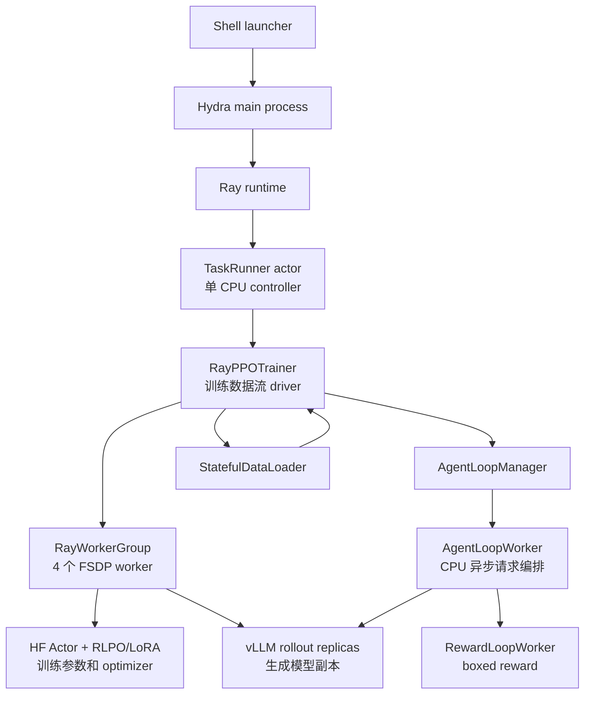
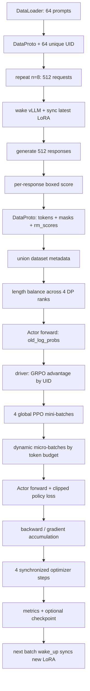
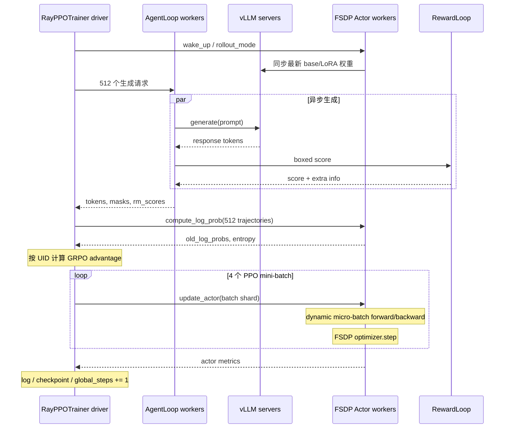

# verl RLPO/GRPO 训练全链路代码讲解

本文以当前仓库的标准 RLPO-init 训练入口和一次实际运行配置为主线，完整追踪：

```text
Shell 启动脚本
  -> Hydra 配置入口
  -> Ray driver / TaskRunner
  -> 资源池与 FSDP worker group
  -> Hugging Face 模型 + RLPO/LoRA + optimizer
  -> vLLM rollout server + AgentLoop
  -> StatefulDataLoader
  -> 一个 global batch 的 rollout / reward / GRPO / PPO update
  -> 日志、checkpoint、下一步权重同步
```

报告既说明“代码调用到哪里”，也解释关键语法、数据结构、张量形状和算法含义。主线对应以下配置：

| 项目 | 当前值 | 训练含义 |
| --- | ---: | --- |
| Actor backend | FSDP1 | 4 卡数据并行和参数分片 |
| Rollout backend | vLLM async | 使用异步推理服务生成 response |
| PEFT 类型 | RLPO-init | 用 RLPO 方法初始化普通 LoRA A/B |
| Advantage estimator | GRPO | 同一 prompt 的 8 条 response 组内标准化 |
| Prompt global batch | 64 | 每个 trainer step 读取 64 个问题 |
| Rollout `n` | 8 | 每个问题生成 8 条回答 |
| Trajectory global batch | 512 | `64 * 8` 条完整轨迹 |
| PPO prompt mini-batch | 16 | 每次更新使用 16 个 prompt 对应的数据 |
| PPO trajectory mini-batch | 128 | `16 * 8` 条轨迹 |
| PPO epochs | 1 | 512 条轨迹只训练一轮 |
| Optimizer steps / trainer step | 4 | `64 / 16 * 1` |
| Reward | boxed math accuracy | 二值 outcome reward |
| Critic | 禁用 | GRPO 不需要 value model |
| Reference policy / KL | 禁用 | 当前 reward 和 loss 都不加 KL |

> “global batch”在 verl 中容易产生歧义。本文把 DataLoader 一次取出的 64 个 prompt 称为 **prompt global batch**；把生成后的 512 条 `(prompt, response)` 称为 **trajectory global batch**；外层 `global_steps` 每处理完整个 512-trajectory batch 才增加 1。

---

## 1. 全局架构：谁控制谁，谁持有什么



最重要的所有权关系如下：

| 对象 | 所在进程 | 主要职责 | 是否持有训练参数 |
| --- | --- | --- | --- |
| `main()` | 启动进程 | Hydra 配置、初始化 Ray | 否 |
| `TaskRunner` | Ray actor | 装配角色、资源、数据和 trainer | 否 |
| `RayPPOTrainer` | TaskRunner 进程 | 控制一个 step 的 RPC 和轻量计算 | 否 |
| `AsyncActorRolloutRefWorker` | 4 个 GPU Ray worker | FSDP Actor、optimizer、vLLM 权重同步 | 是 |
| `DataParallelPPOActor` | GPU worker 内部 | log-prob、PPO loss、backward、step | 是，引用 FSDP module |
| `vLLM` server | rollout worker/server | 高吞吐生成 | 有推理副本，无 optimizer |
| `AgentLoopWorker` | Ray CPU actor | 单样本异步生成和 reward 调度 | 否 |
| `RewardLoopWorker` | Ray actor | 执行自定义 boxed reward | 否 |

`RayPPOTrainer` 虽然叫 trainer，却不是实际执行神经网络 backward 的进程。它更像数据流控制器：准备一个 `DataProto`，通过 worker group RPC 发出 `compute_log_prob()`、`update_actor()` 等命令，再合并结果。

---

## 2. 第一段：Shell 启动链路

### 2.1 入口脚本

常用入口是 [`scripts/local/start_rlpo_init_4gpu.sh`](../scripts/local/start_rlpo_init_4gpu.sh)，它最终 `exec` 到 [`examples/verl_train/run_dapo_math_boxed_rlpo_init_1p5b_4gpu_8k.sh`](../examples/verl_train/run_dapo_math_boxed_rlpo_init_1p5b_4gpu_8k.sh)，后者再复用 [`run_dapo_math_boxed_stable_lora_1p5b_4gpu_8k.sh`](../examples/verl_train/run_dapo_math_boxed_stable_lora_1p5b_4gpu_8k.sh)。

调用关系：

```text
scripts/local/start_rlpo_init_4gpu.sh
  -> conda run -n peft-for-rl
  -> examples/.../run_dapo_math_boxed_rlpo_init_1p5b_4gpu_8k.sh
  -> export PEFT_TYPE=rlpo 及本实验默认值
  -> examples/.../run_dapo_math_boxed_stable_lora_1p5b_4gpu_8k.sh
  -> python3 -m verl.trainer.main_ppo key=value ...
```

### 2.2 关键 Bash 语法

```bash
set -xeuo pipefail
```

- `-x`：执行前打印展开后的命令，因此日志能看到完整 Hydra 参数。
- `-e`：普通命令非零退出时立即终止脚本。
- `-u`：读取未定义变量时报错。
- `-o pipefail`：管道中任一命令失败，整个管道失败。

```bash
SCRIPT_DIR="$(cd -- "$(dirname -- "${BASH_SOURCE[0]}")" && pwd)"
```

- `${BASH_SOURCE[0]}` 是当前脚本文件，不是调用者的工作目录。
- `$(...)` 是命令替换，将命令标准输出作为字符串。
- `--` 表示后面的值即使以 `-` 开头也不再被当作命令选项。

```bash
export TRAIN_PROMPT_BSZ="${TRAIN_PROMPT_BSZ:-64}"
```

`${变量:-默认值}` 表示变量未定义或为空时使用默认值；已由调用者设置时保留调用者的值。因此同一脚本既有稳定默认值，又允许在命令行覆盖：

```bash
TRAIN_PROMPT_BSZ=32 TOTAL_TRAINING_STEPS=20 \
  bash scripts/local/start_rlpo_init_4gpu.sh
```

```bash
actor_updates_per_step=$((train_prompt_bsz / train_prompt_mini_bsz * ppo_epochs))
```

`$((...))` 是 Bash 整数算术。本配置得到 `64 / 16 * 1 = 4`，即一个 trainer step 内有 4 个 optimizer step。

```bash
exec python3 -m verl.trainer.main_ppo ...
```

`exec` 用 Python 进程替换当前 shell，而不是再创建一个长期存在的父进程。信号和退出码因此能更直接地传递给训练程序。

### 2.3 Hydra 命令行覆盖语法

启动脚本把参数写成：

```bash
data.train_batch_size=64
actor_rollout_ref.rollout.n=8
+actor_rollout_ref.model.peft_type=rlpo
trainer.total_training_steps=270
```

- `a.b.c=value`：覆盖配置树中已有字段。
- `+a.b.c=value`：向结构化配置中新增字段；没有 `+` 时 Hydra 可能拒绝未知键。
- `True`、`False`、数字和列表会按 Hydra grammar 解析，不一定是字符串。
- Shell 展开先发生，Hydra 解析后发生，所以引号主要负责保护参数不被 Shell 拆分。

---

## 3. 第二段：Hydra 入口和 `run_ppo`

入口文件是 [`verl/trainer/main_ppo.py`](../verl/trainer/main_ppo.py)。

### 3.1 `@hydra.main`

[`main_ppo.py:35`](../verl/trainer/main_ppo.py#L35)：

```python
@hydra.main(config_path="config", config_name="ppo_trainer", version_base=None)
def main(config):
    auto_set_device(config)
    run_ppo(config)
```

`@hydra.main(...)` 是 Python 装饰器。可近似理解为：

```python
main = hydra.main(...)(main)
```

Hydra 包装后的函数先读取 `config/ppo_trainer` 配置、合并 defaults 和命令行覆盖，再调用原始 `main(config)`。`config` 是 OmegaConf 的 `DictConfig`，既支持 `config["trainer"]`，也支持 `config.trainer`。

### 3.2 初始化 Ray runtime

[`run_ppo()`](../verl/trainer/main_ppo.py#L49) 首先检查：

```python
if not ray.is_initialized():
    default_runtime_env = get_ppo_ray_runtime_env()
    ray_init_kwargs = config.ray_kwargs.get("ray_init", {})
    runtime_env = OmegaConf.merge(default_runtime_env, runtime_env_kwargs)
    ray.init(**OmegaConf.to_container(ray_init_kwargs))
```

语法与行为：

- `.get("ray_init", {})`：键不存在时返回空字典，避免 `KeyError`。
- `OmegaConf.merge(a, b)`：递归合并，靠后的 `b` 对同名字段优先。
- `OmegaConf.to_container(...)`：把 `DictConfig` 转为普通 `dict/list`。
- `**mapping`：关键字参数展开，例如 `ray.init(**{"num_gpus": 4})` 等价于 `ray.init(num_gpus=4)`。

Ray runtime environment 会注入 tokenizer、NCCL、vLLM 和超时监控相关环境变量，默认值来自 [`verl/trainer/constants_ppo.py`](../verl/trainer/constants_ppo.py)。

### 3.3 把 `TaskRunner` 包装成 Ray actor

```python
task_runner_class = ray.remote(num_cpus=1)(TaskRunner)
runner = task_runner_class.remote()
ray.get(runner.run.remote(config))
```

三句分别表示：

1. `ray.remote(...)(TaskRunner)`：把普通 Python 类包装为远程 actor class。
2. `.remote()`：在 Ray 集群中异步创建 actor，返回 actor handle。
3. `runner.run.remote(config)`：异步调用远程方法，返回 `ObjectRef`。
4. `ray.get(ObjectRef)`：当前启动进程同步等待结果，并把远程异常传播回来。

所以 `run_ppo()` 本身不训练模型，只负责 Ray 生命周期的外层启动和等待。

---

## 4. 第三段：`TaskRunner.run()` 装配训练系统

主装配函数位于 [`main_ppo.py:256`](../verl/trainer/main_ppo.py#L256)。


### 4.1 角色表与资源表

`TaskRunner` 维护：

```python
self.role_worker_mapping = {}
self.mapping = {}
```

当前 FSDP 路径注册：

```python
self.role_worker_mapping[Role.ActorRollout] = ray.remote(AsyncActorRolloutRefWorker)
self.mapping[Role.ActorRollout] = "global_pool"
```

第一个字典回答“角色由哪个 worker class 实现”，第二个回答“角色使用哪个 GPU resource pool”。`Role` 是枚举而不是裸字符串，可减少拼写错误。

当前配置虽然会注册 `CriticWorker` 类，但 `need_critic(config)` 因 `adv_estimator=grpo` 返回 false，`RayPPOTrainer.init_workers()` 不会真正实例化 critic worker group。

Reference Policy 只有在以下任一项开启时注册：

```python
config.algorithm.use_kl_in_reward
config.actor_rollout_ref.actor.use_kl_loss
```

当前两项均为 false，因此没有 RefPolicy 模型。

### 4.2 动态 import 的意义

代码在分支内部执行：

```python
if strategy in {"fsdp", "fsdp2"}:
    from verl.workers.fsdp_workers import AsyncActorRolloutRefWorker
elif strategy == "megatron":
    from verl.workers.megatron_workers import AsyncActorRolloutRefWorker
```

这是延迟导入。只有选择某个 backend 才导入对应依赖，能避免未使用 backend 的重依赖在启动时失败，也让同一个 trainer 支持多套 worker 实现。

### 4.3 tokenizer、reward manager 和 dataset

`copy_to_local()` 把远端模型目录准备到本地后创建 tokenizer/processor。纯文本模型的 processor 可以是 `None`。

训练和验证 reward manager 分别通过 [`load_reward_manager()`](../verl/trainer/ppo/reward.py) 创建。当前 manager 名称是 `dapo`，自定义 score 函数来自 [`boxed_math_accuracy.py`](../verl/utils/reward_score/boxed_math_accuracy.py)。

dataset 通过 [`create_rl_dataset()`](../verl/trainer/main_ppo.py#L365) 创建，sampler 通过 [`create_rl_sampler()`](../verl/trainer/main_ppo.py#L395) 创建。当前 `shuffle=True`，使用可保存状态的 `torchdata.stateful_dataloader.sampler.RandomSampler`，使 checkpoint 恢复时可以恢复数据顺序。

最后构造 `RayPPOTrainer`，依次执行：

```python
trainer.init_workers()
trainer.fit()
```

---

## 5. 第四段：资源池和 worker group 初始化

### 5.1 ResourcePool

[`TaskRunner.init_resource_pool_mgr()`](../verl/trainer/main_ppo.py#L194) 为当前单机 4 卡构造：

```python
resource_pool_spec = {
    "global_pool": [4],
}
```

多机 2 节点、每节点 8 卡时会是 `[8, 8]`。后续 `ResourcePoolManager.create_resource_pool()` 把规格转换为 Ray placement group，保证属于同一 worker group 的资源按预期分配。

### 5.2 `init_workers()`

[`RayPPOTrainer.init_workers()`](../verl/trainer/ppo/ray_trainer.py#L936) 依次：

1. 创建 resource pool。
2. 将 ActorRollout 角色包装为 `RayClassWithInitArgs`。
3. 用 `create_colocated_worker_cls()` 把同一 pool 中的角色组合起来。
4. 创建 `RayWorkerGroup` 并 `spawn()` 4 个 GPU worker。
5. 调用 `actor_rollout_wg.init_model()`。
6. 创建异步 `AgentLoopManager` 和 vLLM server。

“colocated”表示 Actor 训练和 rollout 推理共享同一组物理 GPU，而不是各占 4 张卡。这要求程序在训练模式和 rollout 模式之间显式搬移/释放状态。

### 5.3 RPC 装饰器

FSDP worker 方法上常见：

```python
@register(dispatch_mode=make_nd_compute_dataproto_dispatch_fn(mesh_name="actor"))
def compute_log_prob(self, data: DataProto):
    ...
```

`@register` 不只是登记名字，还记录 dispatch 规则。controller 调用：

```python
self.actor_rollout_wg.compute_log_prob(batch)
```

worker group 会自动：

```text
切分 global DataProto
  -> 分发到 4 个 DP worker
  -> 每个 worker 执行同名方法
  -> 收集输出
  -> 拼回 global DataProto
```

因此源码中看不到显式的 `for rank in workers`，分发逻辑被装饰器和 `RayWorkerGroup` 封装了。

---

## 6. 第五段：构造 HF Actor、RLPO adapter 和 FSDP

主要代码位于 [`ActorRolloutRefWorker.init_model()`](../verl/workers/fsdp_workers.py#L958) 和 [`_build_model_optimizer()`](../verl/workers/fsdp_workers.py#L304)。

### 6.1 加载基础模型

```python
actor_model_config = AutoConfig.from_pretrained(local_path, ...)
actor_module = AutoModelForCausalLM.from_pretrained(
    pretrained_model_name_or_path=local_path,
    torch_dtype=torch.float32,
    config=actor_model_config,
)
```

Actor 初始以 FP32 构造，原因是 optimizer state 不应因为直接用 BF16 构造模型而失去精度。真正 forward 在 autocast 下使用配置的低精度。

`with init_context(), warnings.catch_warnings():` 是两个 context manager。进入 `with` 时建立临时上下文，离开时自动恢复状态，即使内部抛异常也会执行清理逻辑。

当前 `peft_type=rlpo` 会关闭 meta tensor 初始化，因为 RLPO 初始化必须读取基础权重做真实 SVD。

### 6.2 注入普通 LoRA，再做 RLPO 初始化

[`fsdp_workers.py:519`](../verl/workers/fsdp_workers.py#L519)：

```python
actor_module = get_peft_model(
    actor_module,
    LoraConfig(r=32, lora_alpha=64, lora_dropout=0.05, ...),
)
apply_rlpo_initialization(actor_module, config.model)
```

对冻结线性层 `W in R^(d_out x d_in)`：

```text
W = U diag(s) Vh
A_0 = Vh[:r, :]
B_0 = 0
Delta W_0 = (alpha / r) B_0 A_0 = 0
```

实现位于 [`verl/utils/peft_rlpo.py`](../verl/utils/peft_rlpo.py)。初始化时模型函数与 base model 完全相同，因为 `B_0=0`；训练阶段不再运行 SVD，A/B 就是普通可训练 LoRA 参数。

### 6.3 FSDP 包装和 optimizer

模型注入 adapter 后被 FSDP 包装。FSDP 的关键作用是：

- 将参数、梯度和 optimizer state 分片到 4 张卡。
- forward 前按需 all-gather 参数，结束后按配置 reshard。
- backward 时 reduce-scatter 梯度。
- `clip_grad_norm_()` 在所有 shard 上得到全局一致的梯度范数。

当前 `param_offload=True`、`optimizer_offload=True`，所以不使用时还会把参数和 optimizer state 放到 CPU，节省 GPU 内存，但会增加 CPU/GPU 传输时间。

worker 最终创建：

```python
self.actor = DataParallelPPOActor(
    config=actor_cfg,
    actor_module=self.actor_module_fsdp,
    actor_optimizer=self.actor_optimizer,
)
```

`DataParallelPPOActor` 不复制模型，只持有 FSDP module 和 optimizer 的引用，负责实现 PPO 所需的 forward/loss/update。

---

## 7. 第六段：构造异步 vLLM rollout 系统

`RayPPOTrainer.init_workers()` 最后创建 [`AgentLoopManager`](../verl/experimental/agent_loop/agent_loop.py#L857)。

### 7.1 为什么有两层 worker

```text
AgentLoopWorker: CPU 上组织一条 trajectory，可以处理 chat template、工具调用、reward
vLLM server: GPU 上只关心 token-in/token-out 高吞吐推理
```

这使单轮对话、多轮 tool agent、不同 reward 逻辑都能复用同一个 vLLM 服务。

### 7.2 async/await 语法

单个 AgentLoopWorker 内部使用：

```python
tasks.append(asyncio.create_task(self._run_agent_loop(...)))
outputs = await asyncio.gather(*tasks)
```

- `async def` 定义协程函数，调用后先得到 coroutine object。
- `asyncio.create_task()` 把 coroutine 安排到事件循环。
- `await` 暂停当前协程，但线程可以继续推进其他请求。
- `asyncio.gather(*tasks)` 并发等待全部任务；`*tasks` 是位置参数展开。

它不是让一个 Python 函数同时占用多个 CPU 核，而是在等待 vLLM/network 时切换到其他请求，提高 I/O 并发。

---

## 8. `fit()` 开始前的准备

训练循环位于 [`RayPPOTrainer.fit()`](../verl/trainer/ppo/ray_trainer.py#L1458)。进入 batch loop 之前会：

1. 创建 console/W&B 等 tracking backend。
2. 初始化 `global_steps=0`。
3. `_load_checkpoint()`；当前 `resume_mode=disable`，不恢复旧状态。
4. 按需做 train-before-validation；当前 `val_before_train=False`。
5. 创建进度条。
6. 将第一个实际训练 step 编号设为 1。

DataLoader 在 [`_create_dataloader()`](../verl/trainer/ppo/ray_trainer.py#L493) 中构造：

```python
self.train_dataloader = StatefulDataLoader(
    dataset=self.train_dataset,
    batch_size=64,
    drop_last=True,
    collate_fn=collate_fn,
    sampler=train_sampler,
)
```

`StatefulDataLoader` 的价值是 checkpoint 可以保存迭代位置和 sampler RNG 状态，而不只是模型参数。

---

## 9. 一个 global batch 的完整数据流



### 9.1 数据结构：`DataProto`

verl 在 driver 和 worker 间传输的核心容器是 [`verl/protocol.py`](../verl/protocol.py) 中的 `DataProto`。它分三层：

| 字段 | 内容 | 示例 |
| --- | --- | --- |
| `batch` | 可堆叠 TensorDict | `input_ids`, `responses`, `old_log_probs` |
| `non_tensor_batch` | NumPy object arrays | `raw_prompt`, `uid`, ground truth |
| `meta_info` | 整批共享的控制信息 | `temperature`, `global_steps` |

常见操作：

```python
batch.repeat(repeat_times=8, interleave=True)
batch.union(other)
batch.pop(batch_keys=[...])
batch.reorder(indices)
DataProto.concat(outputs)
```

- `repeat(..., interleave=True)`：每条样本连续复制 8 次。
- `union()`：按 key 合并同样 batch size 的两个容器。
- `pop()`：把指定字段从原对象移出并组成新 `DataProto`。
- `reorder()`：对 tensor 和 non-tensor 字段应用同一索引，保持样本对齐。
- `concat()`：沿 batch 维拼接多个 worker 的输出。

### 9.2 阶段 A：读取 64 个 prompt

[`RLHFDataset.__getitem__()`](../verl/utils/dataset/rl_dataset.py#L336) 当前不会提前 tokenize，而是返回：

```text
raw_prompt
data_source
reward_model.ground_truth
extra_info / index
dummy_tensor
```

`dummy_tensor` 是过渡字段，用于保证 `DataProto.batch` 不为空。真正 chat-template/tokenize 在 AgentLoop 中做。

[`fit():1526`](../verl/trainer/ppo/ray_trainer.py#L1526) 将 collate 后的字典转为 `DataProto`，并给每个原始 prompt 生成唯一 UUID：

```python
batch.non_tensor_batch["uid"] = np.array(
    [str(uuid.uuid4()) for _ in range(len(batch.batch))],
    dtype=object,
)
```

列表推导式 `[expr for x in iterable]` 在这里生成 64 个字符串；`dtype=object` 允许 NumPy 保存变长 Python 字符串。

### 9.3 阶段 B：复制为 512 个 rollout 请求

[`fit():1534-1540`](../verl/trainer/ppo/ray_trainer.py#L1534)：

```python
gen_batch = self._get_gen_batch(batch)
gen_batch_output = gen_batch.repeat(repeat_times=8, interleave=True)
```

复制后顺序近似：

```text
p0-r0, p0-r1, ..., p0-r7,
p1-r0, p1-r1, ..., p1-r7,
...
```

同一 prompt 的 8 份具有相同 `uid`，但 rollout 的随机采样状态不同，因此生成不同 response。

### 9.4 阶段 C：切换到 rollout mode 并同步权重

当前固定走 async 分支：

```python
gen_batch_output = self.async_rollout_manager.generate_sequences(gen_batch_output)
```

[`AgentLoopManager.generate_sequences()`](../verl/experimental/agent_loop/agent_loop.py#L949) 首先 `wake_up()`。对 hybrid FSDP worker，调用链为：

```text
AgentLoopManager.wake_up
  -> vLLMReplica.wake_up
  -> AsyncActorRolloutRefWorker.wake_up
  -> ActorRolloutRefWorker.rollout_mode
```

[`rollout_mode()`](../verl/workers/fsdp_workers.py#L836) 完成：

1. 将 offload 的 FSDP Actor 参数加载到 GPU。
2. 从 FSDP shard 收集 LoRA/RLPO adapter 参数。
3. 首次运行时连 base model 一起同步；之后主要同步变化的 adapter。
4. 调用 vLLM `update_weights()`。
5. 恢复 vLLM weights 和 KV cache。
6. 切换到 rollout 专用 RNG state。

`base_sync_done` 是一个布尔状态。`load_format=dummy` 表示 vLLM 初始没有从 checkpoint 加载真实权重，所以第一次必须同步 base；成功后置为 true，后续避免重复搬运冻结基础模型。

### 9.5 阶段 D：vLLM 生成 response

`AgentLoopManager` 用 `prompts.chunk(num_workers)` 把 512 条请求分给 AgentLoop workers，再用 `ray.get([...])` 等待所有 chunk。

单条请求走 [`SingleTurnAgentLoop.run()`](../verl/experimental/agent_loop/single_turn_agent_loop.py#L35)：

```text
raw_prompt
  -> apply_chat_template
  -> tokenizer
  -> AsyncLLMServerManager.generate
  -> vLLM async engine.generate
  -> response token IDs
```

当前采样参数：

```text
temperature = 1.0
top_p = 1.0
top_k = -1
max response length = 8192
calculate_log_probs = false
```

由于 rollout 不返回 log-prob，后面必须用 PyTorch Actor 重算 `old_log_probs`。这也避免直接混用 vLLM kernel 与训练模型 kernel 产生的概率数值差异作为 PPO anchor。

### 9.6 阶段 E：在线计算 boxed reward

当前 `reward_model.enable=False` 且 `reward_model.use_reward_loop=True`。因此 response 生成后，[`AgentLoopWorker._compute_score()`](../verl/experimental/agent_loop/agent_loop.py#L705) 立即调用 [`RewardLoopWorker.compute_score()`](../verl/experimental/reward_loop/reward_loop.py#L111)。

自定义函数 [`boxed_math_accuracy.compute_score()`](../verl/utils/reward_score/boxed_math_accuracy.py#L89)：

1. 查找最后一个 `\\boxed{...}` 或 `final answer is ...`。
2. 尝试用 `math_verify` 比较预测答案与 ground truth。
3. 失败时退化为规范化字符串比较。
4. 返回 `score=1.0` 或 `0.0`，附带 parse/format 指标。

AgentLoop 在 [`_postprocess()`](../verl/experimental/agent_loop/agent_loop.py#L736) 中把标量 outcome reward 写到最后一个有效 response token：

```python
rm_scores = torch.zeros_like(response_mask, dtype=torch.float32)
rm_scores[row_index, last_valid_response_index] = score
```

因此 `rm_scores` 的形状是 `[512, 8192]`，但每行至多一个非零位置。

这解释了实际日志中的现象：`timing_s/reward` 接近零，因为真正 reward 已经在 AgentLoop 的 `gen` 阶段完成；trainer 的 reward block 主要是取出已有 `rm_scores`。

### 9.7 阶段 F：形成完整 trajectory batch

AgentLoop 返回的核心 tensor：

| 字段 | 形状 | 含义 |
| --- | --- | --- |
| `prompts` | `[512, 1024]` | 左 padding 的 prompt tokens |
| `responses` | `[512, 8192]` | 右 padding 的生成 tokens |
| `input_ids` | `[512, 9216]` | prompt 与 response 拼接 |
| `attention_mask` | `[512, 9216]` | 排除所有 padding |
| `response_mask` | `[512, 8192]` | 只选择模型生成 token |
| `position_ids` | `[512, 9216]` | 位置编码索引 |
| `rm_scores` | `[512, 8192]` | outcome reward 的 token 表示 |

回到 [`fit():1589`](../verl/trainer/ppo/ray_trainer.py#L1589)，原始 dataset metadata 也复制 8 次，然后 `union()` 到生成结果。此时每条 response 都重新配有正确的 ground truth、data source 和相同 prompt UID。

### 9.8 阶段 G：按 token 工作量平衡 4 个 DP rank

当前 `trainer.balance_batch=True`，执行 [`_balance_batch()`](../verl/trainer/ppo/ray_trainer.py#L1291)。

算法先统计每条序列有效 token 数，再调用 `get_seqlen_balanced_partitions()`，找到数量相等但总工作量尽量接近的 4 个分区。之后 `batch.reorder(global_idx)`，RPC dispatch 按连续切片分给各 rank。

这一步会打乱同一 prompt 的 8 条 response，但 GRPO 后面按 UUID 分组，不依赖样本连续，所以语义不受影响。

### 9.9 阶段 H：提取 reward

[`_compute_or_extract_reward()`](../verl/trainer/ppo/ray_trainer.py#L709) 发现 `rm_scores` 已存在，直接返回：

```python
reward_tensor = batch.batch["rm_scores"]
```

当前不开 KL reward，所以 [`fit():1688`](../verl/trainer/ppo/ray_trainer.py#L1688) 直接令：

```python
batch.batch["token_level_rewards"] = batch.batch["token_level_scores"]
```

若开启 `use_kl_in_reward`，这里会额外计算 old policy 与 reference policy 的 token KL，并执行：

```text
token_reward = score - beta * KL
```

当前路径不执行该分支。

### 9.10 阶段 I：重算固定的 `old_log_probs`

调用链：

```text
RayPPOTrainer._compute_old_log_prob
  -> RayWorkerGroup.compute_log_prob
  -> AsyncActorRolloutRefWorker.compute_log_prob
  -> DataParallelPPOActor.compute_log_prob
  -> DataParallelPPOActor._forward_micro_batch
```

代码位置：

- driver 包装：[`ray_trainer.py:1366`](../verl/trainer/ppo/ray_trainer.py#L1366)
- FSDP worker：[`fsdp_workers.py:1181`](../verl/workers/fsdp_workers.py#L1181)
- 本地 actor：[`dp_actor.py:407`](../verl/workers/actor/dp_actor.py#L407)
- 模型 forward：[`dp_actor.py:126`](../verl/workers/actor/dp_actor.py#L126)

512 条轨迹经 RPC 分给 4 个 DP rank，每卡 128 条。`use_dynamic_bsz=True` 时，[`prepare_dynamic_batch()`](../verl/workers/actor/dp_actor.py#L437) 按 `log_prob_max_token_len_per_gpu=12288` 动态装箱。

`use_remove_padding=True` 的 forward 大致为：

```text
padded input_ids/attention_mask
  -> unpad_input
  -> 将 token 序列 roll(-1) 得到 next-token labels
  -> BF16 causal-LM forward
  -> logprobs_from_logits(logits, next_token)
  -> pad_input 恢复 batch 形状
  -> 截取 response 对应位置
```

注意 causal LM 的错位：位置 `t` 的 logits 预测位置 `t+1` 的 token。因此源码截取 `[-response_length-1:-1]`，而不是直接截最后 `response_length` 个 logits。

整个过程位于 `torch.no_grad()` 中，不保存 backward graph，输出：

```text
old_log_probs [512, 8192]
entropys      [512, 8192]
```

`old_log_probs` 在本 global batch 的全部 4 次 optimizer update 中保持冻结，是 PPO ratio 的 proximal anchor。

### 9.11 阶段 J：GRPO advantage

当前不会调用 Critic。driver 在 [`compute_advantage()`](../verl/trainer/ppo/ray_trainer.py#L186) 中选择 [`compute_grpo_outcome_advantage()`](../verl/trainer/ppo/core_algos.py#L265)。

对每条 response 先将 token reward 求和：

```text
s_i = sum_t reward[i, t]
```

再按 `uid` 找到同一个 prompt 的 8 条 response：

```text
mu_g    = mean(s_1, ..., s_8)
sigma_g = std(s_1, ..., s_8)
A_i     = (s_i - mu_g) / (sigma_g + 1e-6)
```

最后：

```python
advantages = A_i[:, None] * response_mask
returns = advantages
```

也就是说，一条 response 内所有有效生成 token 共用同一个 outcome advantage。若某个 prompt 的 8 条回答全部为 0 或全部为 1，则每条都等于组均值，整组 advantage 为 0，该组不贡献 policy gradient。

虽然 `compute_advantage()` 收到 `num_repeat=8`，当前 GRPO 实现真正依赖的是 `uid` 分组。这样即使 batch 已被长度平衡重排也能正确聚合。

### 9.12 当前跳过的 RefPolicy 和 Critic

[`fit():1666-1676`](../verl/trainer/ppo/ray_trainer.py#L1666) 有两个条件分支：

```python
if self.use_reference_policy:
    ref_log_prob = self._compute_ref_log_prob(batch)

if self.use_critic:
    values = self._compute_values(batch)
```

当前两者都为 false，因此不会加载 reference model，不会做 value forward，也不会 `_update_critic()`。

日志中 `critic/score/*`、`critic/advantages/*` 只是 [`compute_data_metrics()`](../verl/trainer/ppo/metric_utils.py) 沿用的指标命名前缀，不表示 CriticWorker 实际运行。

---

## 10. Actor update：从 512 条轨迹到 4 次参数更新

### 10.1 三层 batch 的数量关系

worker 初始化时，[`fsdp_workers.py:268`](../verl/workers/fsdp_workers.py#L268) 将配置中的 prompt mini-batch 转换为每卡 trajectory mini-batch：

```python
local_ppo_mini_batch_size = (
    configured_prompt_mini_batch_size * rollout_n / dp_size
)
```

代入当前值：

```text
global trajectory batch     = 64 * 8       = 512
global trajectory mini-batch= 16 * 8       = 128
local trajectory batch      = 512 / 4      = 128 / GPU
local trajectory mini-batch = 128 / 4      = 32 / GPU
mini-batches                = 128 / 32     = 4 / GPU
```

四卡在相同 mini-batch 序号上同步，因此全局看是 4 次 optimizer step，而不是 `4 GPU * 4 = 16` 次。

### 10.2 update 调用链

```text
RayPPOTrainer._update_actor
  -> actor_rollout_wg.update_actor
  -> ActorRolloutRefWorker.update_actor
  -> DataParallelPPOActor.update_policy
  -> _forward_micro_batch
  -> compute_policy_loss_vanilla
  -> loss.backward
  -> _optimizer_step
```

代码位置：

- driver：[`ray_trainer.py:1391`](../verl/trainer/ppo/ray_trainer.py#L1391)
- FSDP worker：[`fsdp_workers.py:1089`](../verl/workers/fsdp_workers.py#L1089)
- update 主体：[`dp_actor.py:469`](../verl/workers/actor/dp_actor.py#L469)
- policy loss：[`core_algos.py:907`](../verl/trainer/ppo/core_algos.py#L907)

### 10.3 mini-batch 与 dynamic micro-batch

[`update_policy()`](../verl/workers/actor/dp_actor.py#L469)：

```python
mini_batches = data.split(self.config.ppo_mini_batch_size)

for _ in range(self.config.ppo_epochs):
    for mini_batch in mini_batches:
        micro_batches, _ = prepare_dynamic_batch(
            mini_batch,
            max_token_len=self.config.ppo_max_token_len_per_gpu,
        )
```

每卡的 128 条数据切为 4 个 32 条 mini-batch。每个 32 条 mini-batch 再按 token 预算 12288 动态切成若干 micro-batch：

```text
mini-batch：定义一次 optimizer.step 使用的统计样本集合
micro-batch：为适应显存而分段 forward/backward，期间只累积梯度
```

长达 8192 token 的样本可能单独构成一个 micro-batch，短样本可以多个装在一起。因此不能只从“样本条数”推断显存和耗时。

### 10.4 第二次 Actor forward

`old_log_probs` 阶段的 forward 是无梯度快照；这里的 forward 是当前待更新参数 `theta` 的有梯度计算：

```python
entropy, log_prob = self._forward_micro_batch(...)
```

输入保留：

```text
responses
response_mask
input_ids
attention_mask
position_ids
old_log_probs
advantages
```

当前 `ppo_epochs=1` 但有 4 个 mini-batch，所以第 2、3、4 个 mini-batch forward 时，模型已经被前面的 mini-batch 更新过；它们仍然与本 global batch 开始时固定的 `old_log_probs` 比较。这正是 PPO clipping 所约束的策略漂移。

### 10.5 PPO ratio 与 dual-clip loss

[`compute_policy_loss_vanilla()`](../verl/trainer/ppo/core_algos.py#L907) 先算：

```text
log_ratio_t = log pi_theta(a_t|s_t) - log pi_old(a_t|s_t)
ratio_t     = exp(clamp(log_ratio_t, -20, 20))
```

标准 clipped surrogate：

```text
loss_1 = -A_t * ratio_t
loss_2 = -A_t * clip(ratio_t, 1-clip_low, 1+clip_high)
```

当前 `clip_low=0.2`、`clip_high=0.28`，所以 ratio 主要被限制在 `[0.8, 1.28]`。对负 advantage 还使用 `clip_ratio_c=10` 的 dual-clip 下界，防止极端 ratio 产生过大的负样本更新。

`response_mask` 确保 prompt token、padding token，以及多轮 agent 中非模型生成的 observation token不参与 policy loss。

### 10.6 loss 聚合

当前：

```text
loss_agg_mode = token-mean
entropy_coeff = 0
use_kl_loss = false
```

[`agg_loss()`](../verl/trainer/ppo/core_algos.py#L772) 对它收到的**当前 micro-batch**执行 token-mean：有效 response token 的 loss 求和，再除以该 micro-batch 的有效 token 数。若整个 mini-batch 一次送入，这等价于严格的全 mini-batch token mean；当前 dynamic-batch 路径会先分别计算每个 micro-batch 的 token mean，再在外层缩放并累积。

因为 entropy coefficient 为 0，entropy 只在 old-log-prob 阶段作为监控指标，不作为正则加入 loss；因为 KL loss 关闭，也不会读取 `ref_log_prob`。

### 10.7 backward、梯度累积和 optimizer step

对一个 mini-batch 内的每个 dynamic micro-batch：

```python
loss_scale_factor = micro_batch_size / local_ppo_mini_batch_size
loss = policy_loss * loss_scale_factor
loss.backward()
```

`loss_scale_factor` 按“micro-batch 的序列条数 / 本地 mini-batch 的序列条数”缩放，目的是让不同大小的 dynamic micro-batch 累积后对应完整 32 条本地 mini-batch，而不是让 micro-batch 数量直接改变总体 loss 尺度。

这里有一个值得注意的实现细节：当前 legacy FSDP `dp_actor.py` 路径不是先汇总所有 micro-batch 的 token loss 和 token count，再做一次严格的 global token mean，而是：

```text
sum_m [ (micro_bsz_m / mini_bsz) * mean_token_loss_m ]
```

所以当 dynamic micro-batch 的序列长度分布差异较大时，它与“完整 mini-batch 所有 token 直接求均值”并不完全相同。`loss_agg_mode=token-mean` 精确描述了每次 `agg_loss()` 的局部聚合方式；外层跨 dynamic micro-batch 的权重则按序列条数计算。分析长度偏置或复现实验时应保留这个区别。

全部 micro-batch backward 完成后调用 [`_optimizer_step()`](../verl/workers/actor/dp_actor.py#L380)：

```python
grad_norm = self.actor_module.clip_grad_norm_(max_norm=1.0)
if torch.isfinite(grad_norm):
    self.actor_optimizer.step()
else:
    self.actor_optimizer.zero_grad()
```

- `torch.isfinite()` 同时排除 NaN 和正负 infinity。
- FSDP 的 `clip_grad_norm_()` 针对完整分布式参数计算范数。
- 非有限梯度时跳过更新，防止污染参数和 optimizer state。

一个 512-trajectory global batch 执行上述 mini-batch 流程 4 次，也就是 4 次同步 optimizer step。RLPO 在这里没有专用 loss 或 rank allocator；更新对象就是 RLPO 初始化后的普通 LoRA A/B。

FSDP worker 在 `update_policy()` 整体结束后才执行一次 LR scheduler step。当前 scheduler 是 constant，因此日志中的 `actor/lr` 保持 `1e-6`。

---

## 11. 一个 global batch 中参数和数据分别在哪里



需要区分三份“策略”：

| 名称 | 物理载体 | 当前 step 中的作用 |
| --- | --- | --- |
| rollout policy | vLLM 权重副本 | 生成 response |
| old policy | `old_log_probs` tensor 快照 | PPO ratio 的固定分母 |
| current policy | FSDP Actor 参数 | 依次经过 4 次 mini-batch 更新 |

当前关闭 reference policy，所以没有第四份冻结 base/reference 策略。虽然 rollout 与 Actor 在 step 开始时同步，但由于推理 kernel、调度和随后的 mini-batch 更新不同，代码仍显式保存 old log-prob，而不是假定它永远等于当前 log-prob。

---

## 12. global batch 收尾：指标、checkpoint 和下一步

[`fit():1747-1845`](../verl/trainer/ppo/ray_trainer.py#L1747) 依次处理：

1. 按 `test_freq` 验证；当前为 0，跳过。
2. 按 `save_freq` 保存；当前每 50 个 trainer step。
3. 停止当前 step profiler。
4. 汇总 reward、advantage、长度、耗时、吞吐和显存指标。
5. `logger.log(metrics, step=global_steps)`。
6. `progress_bar.update(1)`。
7. `global_steps += 1`。
8. 最后一步等待异步调用收尾并返回。

### 12.1 checkpoint

[`RayPPOTrainer._save_checkpoint()`](../verl/trainer/ppo/ray_trainer.py#L1123) 调用 worker 的 [`save_checkpoint()`](../verl/workers/fsdp_workers.py#L1257)。典型目录：

```text
trainer.default_local_dir/
  global_step_50/
    actor/
      ... FSDP/HF checkpoint ...
      peft_adapter/
        adapter_model.safetensors
        adapter_config.json
```

除了模型，还可能保存 optimizer、scheduler、DataLoader 和 trainer extra state，具体取决于 `checkpoint.save_contents`。

### 12.2 下一步如何看到新参数

Actor update 后不会立即把权重推送给正在休眠的 vLLM。下一个 global batch 开头再次执行：

```text
AgentLoopManager.wake_up
  -> rollout_mode
  -> collect_lora_params
  -> vLLM.update_weights
```

因此权重同步位于“下一步 rollout 之前”，语义仍是每批 rollout 使用最新完成更新的策略。

---

## 13. 用实际日志验证调用链

参考运行日志 [`rlpo_init_r32a64_b64m16n8_270_4gpu_boxed_v2.log`](../runs/logs/verl/rlpo_init_r32a64_b64m16n8_270_4gpu_boxed_v2.log) 的第一个 step：

```text
timing_s/gen             ~= 354.65 s
timing_s/reward          ~=   0.0001 s
timing_s/old_log_prob    ~=  95.30 s
timing_s/adv             ~=   0.03 s
timing_s/update_actor    ~= 262.49 s
timing_s/step            ~= 712.60 s
```

这些数值对应：

- `gen`：vLLM 生成、AgentLoop 后处理以及在线 reward。
- `reward`：从已存在的 `rm_scores` 提取 reward，因此几乎没有开销。
- `old_log_prob`：PyTorch/FSDP Actor 对 512 条长序列做无梯度 forward。
- `adv`：driver 上按 64 个 UID 分组做简单张量统计。
- `update_actor`：4 个 PPO mini-batch 的 forward/backward/optimizer step。

`response_length/clip_ratio` 很高时，大量回答达到 8192 token 上限，通常会同时推高 `gen`、`old_log_prob` 和 `update_actor` 时间。

---

## 14. 配置改变时会切到哪些旁路

| 条件 | 新增执行路径 | 主要文件 |
| --- | --- | --- |
| `adv_estimator=gae` | compute values、GAE、update critic | `ray_trainer.py`, `critic/dp_critic.py` |
| `use_kl_in_reward=True` | ref log-prob、KL reward penalty | `ray_trainer.py`, `core_algos.py` |
| `actor.use_kl_loss=True` | policy loss 加 reference KL | `dp_actor.py` |
| `reward_model.enable=True` | 创建 RM worker 或独立 RM pool | `main_ppo.py`, `reward_loop/` |
| `launch_reward_fn_async=True` | reward 与 old-log-prob 部分重叠 | `trainer/ppo/reward.py` |
| `rollout.calculate_log_probs=True` | rollout 返回 `rollout_log_probs` | `agent_loop.py`, vLLM server |
| `rollout_correction` 开启 | IS weight/rejection/bypass mode | `rollout_corr_helper.py` |
| `ppo_epochs>1` | 同一 512 trajectory 被重复训练 | `dp_actor.py` |
| `use_dynamic_bsz=False` | 按固定每卡 micro-batch 切分 | `dp_actor.py` |
| `peft_type=adalora` | 正交 loss、每 optimizer-step rank allocation | `peft_adalora.py`, `dp_actor.py` |

这些分支共享同一个 `fit()` 骨架，但不能把它们误认为当前 RLPO/GRPO 实验已经执行。例如当前日志没有 Critic forward，尽管指标名称中出现 `critic/score`。

---

## 15. 关键 Python 语法速查

### 装饰器

```python
@register(...)
def update_actor(...):
    ...
```

等价于定义函数后执行 `update_actor = register(...)(update_actor)`；框架借此附加 RPC dispatch 元数据。

### 解包

```python
ray.init(**kwargs)       # dict -> keyword arguments
asyncio.gather(*tasks)  # list -> positional arguments
```

### 集合交集

```python
keys = {"data_source", "reward_model", "uid"} & batch.non_tensor_batch.keys()
```

`&` 对 set-like 对象取交集，只保留实际存在且允许传给 reward 的键。

### 条件表达式

```python
actor_role = Role.ActorRolloutRef if has_ref else Role.ActorRollout
```

这是 Python 三元表达式，先写真值结果，再写条件和假值结果。

### context manager

```python
with torch.no_grad():
    ...
```

进入块时关闭 autograd graph 记录，离开块时恢复；适合 old-log-prob 和 validation 推理。

### tensor 切片

```python
attention_mask[:, -response_length:]
```

第一个 `:` 选择全部 batch 行；负下标从末尾计数，因此选择序列最后 `response_length` 个位置。

### `detach()` 与 `.item()`

```python
pg_loss.detach().item()
```

`detach()` 产生不追踪梯度的视图，`.item()` 把单元素 tensor 转为 Python 标量，适合日志；不能把 `.item()` 后的值继续用于需要梯度的 loss。

---

## 16. 排查问题时从哪里开始

| 症状 | 优先检查的指标/代码 |
| --- | --- |
| 启动即失败 | launcher 的路径检查、Hydra override、`validate_config()` |
| Ray actor 起不来 | `run_ppo()` runtime env、resource pool、Ray temp dir |
| 初始化很慢 | RLPO SVD 日志、`apply_rlpo_initialization()` |
| rollout OOM | vLLM `gpu_memory_utilization`、`max_num_seqs`、response length |
| Actor forward OOM | `log_prob_max_token_len_per_gpu`、dynamic batch、remove padding |
| update OOM | `ppo_max_token_len_per_gpu`、gradient checkpointing、offload |
| step 特别慢 | 日志中的 `gen/old_log_prob/update_actor` 分项 |
| reward 全零 | boxed parser、ground truth、同组 8 条输出 |
| advantage 全零 | 同一 UID 的 8 条 reward 是否完全一致 |
| clip fraction 变大 | LR、mini-batch 次序、old/current policy 漂移 |
| rollout 与 Actor 不一致 | `rollout_mode()` 的 PEFT 权重同步、vLLM adapter |
| resume 后数据重复 | StatefulDataLoader/sampler state 和 `resume_mode` |

---

## 17. 从头到尾的函数调用索引

```text
start_rlpo_init_4gpu.sh
  -> conda run
  -> run_dapo_math_boxed_rlpo_init_1p5b_4gpu_8k.sh
  -> run_dapo_math_boxed_stable_lora_1p5b_4gpu_8k.sh
  -> python -m verl.trainer.main_ppo

main_ppo.main
  -> auto_set_device
  -> run_ppo
     -> ray.init
     -> ray.remote(TaskRunner)
     -> TaskRunner.run.remote

TaskRunner.run
  -> add_actor_rollout_worker
  -> add_critic_worker                 # 注册类，当前不实例化
  -> add_reward_model_worker           # 当前 RM disabled
  -> add_ref_policy_worker             # 当前 KL disabled
  -> validate_config
  -> hf_tokenizer / hf_processor
  -> load_reward_manager
  -> init_resource_pool_mgr
  -> create_rl_dataset / create_rl_sampler
  -> RayPPOTrainer(...)
  -> RayPPOTrainer.init_workers
     -> ResourcePoolManager.create_resource_pool
     -> RayWorkerGroup.spawn
     -> ActorRolloutRefWorker.init_model
        -> _build_model_optimizer
           -> AutoModelForCausalLM.from_pretrained
           -> get_peft_model(LoraConfig)
           -> apply_rlpo_initialization
           -> FSDP wrap
           -> optimizer / scheduler
           -> DataParallelPPOActor
        -> _build_rollout
     -> AgentLoopManager
        -> initialize vLLM replicas/servers
        -> initialize AgentLoopWorkers
  -> RayPPOTrainer.fit
     -> _load_checkpoint
     -> StatefulDataLoader.__next__                 # 64 prompts
     -> DataProto.from_single_dict
     -> DataProto.repeat(n=8)                       # 512 requests
     -> AgentLoopManager.generate_sequences
        -> wake_up
           -> AsyncActorRolloutRefWorker.rollout_mode
           -> collect LoRA/RLPO weights
           -> vLLM.update_weights
        -> AgentLoopWorker.generate_sequences
           -> SingleTurnAgentLoop.run
              -> apply_chat_template
              -> vLLM generate
           -> RewardLoopWorker.compute_score
              -> boxed_math_accuracy.compute_score
           -> AgentLoopWorker._postprocess
        -> DataProto.concat
        -> sleep / trainer_mode
     -> DataProto.union
     -> _balance_batch
     -> _compute_or_extract_reward
     -> _compute_old_log_prob
        -> FSDP worker.compute_log_prob
        -> DataParallelPPOActor.compute_log_prob
        -> _forward_micro_batch(no_grad)
     -> compute_advantage
        -> compute_grpo_outcome_advantage
     -> _update_actor
        -> FSDP worker.update_actor
        -> DataParallelPPOActor.update_policy
           -> split 4 PPO mini-batches
           -> prepare_dynamic_batch
           -> _forward_micro_batch(with grad)
           -> compute_policy_loss_vanilla
           -> backward
           -> _optimizer_step                       # 共 4 次
        -> scheduler.step                           # 每 trainer step 1 次
     -> compute/log metrics
     -> optional _save_checkpoint
     -> global_steps += 1
     -> next batch
```

---

## 18. 最终心智模型

这套训练不是“调用一次 PPO 函数就更新一次模型”，而是四层循环和两种模型执行系统的组合：

```text
外层 trainer step
  读取 64 prompt，产生并消费 512 trajectory

rollout 层
  vLLM 使用 step 开始时同步的 RLPO/LoRA 权重生成 512 response

PPO mini-batch 层
  512 trajectory 分成 4 组，每组触发一次 optimizer step

dynamic micro-batch 层
  每组再按 token 预算切分，多次 forward/backward 后才 optimizer.step
```

driver 掌握的是数据流和控制流；FSDP worker 掌握训练状态；vLLM 掌握推理副本；AgentLoop 把生成和奖励拼成 trajectory。GRPO 在 driver 上利用 UID 把 8 条 response 重新组织成组内相对优势，PPO loss 再把这个相对优势转成对 RLPO/LoRA 参数的梯度。完成 4 次 optimizer update 后，一个 `global_step` 才结束，新参数在下一批 rollout 前同步到 vLLM。
